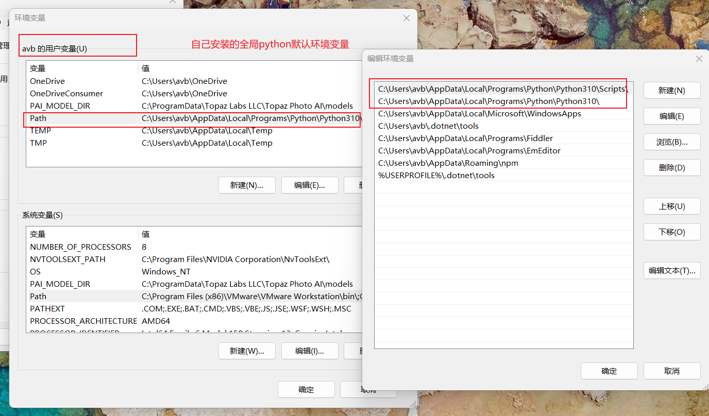
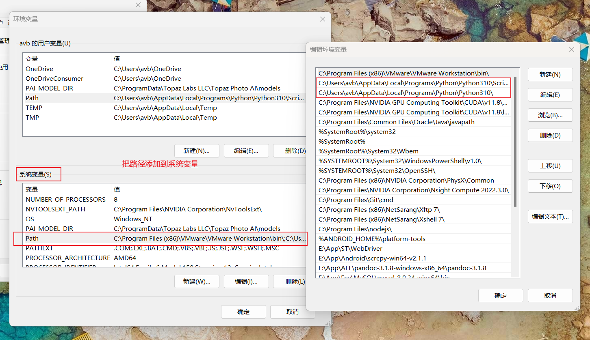
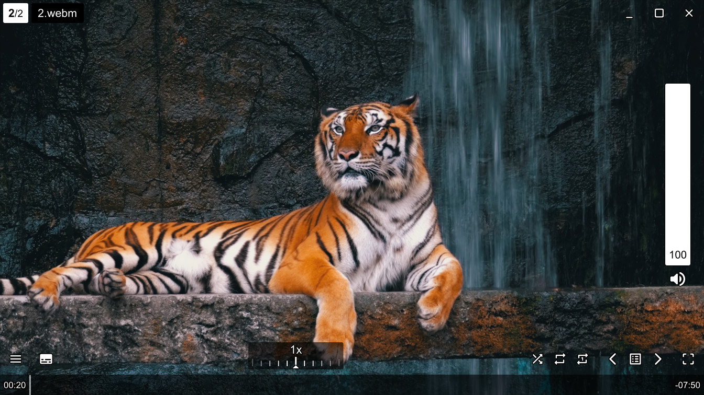
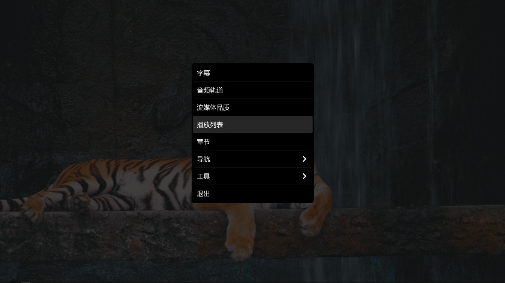

# mpv-plus

## 说明

* 集合常用的功能，不需要复杂的配置，开箱即用。
* 不破坏 mpv 原有的功能，所有扩展功能都是通过快捷键绑定。
* 此配置针对 Windows 平台，如需在其它平台使用，可能需要更改部分代码。

## 安装

>Release 只针对多个环境有更新时才发布，不包含 portable_config，需自行下载配置。

* 从 Release 中下载最新版本解压缩，并进入解压后的根目录。

* 下载最新配置
  ````cmd
  git clone https://github.com/bingloo/mpv-plus.git portable_config
  ````
* 更新最新配置
  ````cmd
  git pull
  ````

## 增加的功能

### 脚本

* uosc 界面
* thumbfast 进度条缩略图
* clipshot 截图到剪贴板
* mpv-playlistmanager 播放列表管理器
* copy-paste-URL 从剪贴板中打开URL
* autoload 自动加载同文件夹内的文件到播放列表

### 着色器

* Anime4K 提升动画的播放质量
* AMD FSR 提升视频的播放质量
* FSRCNNX 提升视频的播放质量

### 插帧

* Python
* VapourSynth
* MVTools

## 快捷键的使用

### 脚本的快捷键

````
c/C					截图到剪贴板
shift+enter				打开播放列表
esc					关闭播放列表
ctrl+v					播放剪贴板的URL
````

### 额外的快捷键

````
ctrl+h					硬件加速，会在"原生模式-copy模式-关闭"中切换
ctrl+n					硬件加速，切换到"nvdec-copy"模式
i/I/tab					常显统计信息
ctrl+`					常显uosc控件
menu/MBTN_MID				打开右键菜单
ctrl+a					打开音轨菜单
ctrl+s					打开字幕菜单
ctrl+p					打开播放列表
ctrl+d					打开当前文件所在目录
ctrl+S					截图当前整个窗体
Ctrl+R					旋转视频
ctrl+f					搜索
````

### 着色器快捷键

````
ctrl+backspace				清空着色器

ctrl+1					Anime4K: Mode A (Fast)
ctrl+2					Anime4K: Mode B (Fast)
ctrl+3					Anime4K: Mode C (Fast)
ctrl+4					Anime4K: Mode A+A (Fast)
ctrl+5					Anime4K: Mode B+B (Fast)
ctrl+6					Anime4K: Mode C+A (Fast)

alt+1					Anime4K: Mode A (HQ)
alt+2					Anime4K: Mode B (HQ)
alt+3					Anime4K: Mode C (HQ)
alt+4					Anime4K: Mode A+A (HQ)
alt+5					Anime4K: Mode B+B (HQ)
alt+6					Anime4K: Mode C+A (HQ)

ctrl+7					设置 AMD-CAS-scaled
alt+7					附加 AMD-CAS-scaled

ctrl+8					设置 AMD-FSR
alt+8					附加 AMD-FSR

ctrl+9					设置 FSRCNNX_16
alt+9					附加 FSRCNNX_16
````

### 插帧快捷键

````
alt+backspace				清除所有滤镜

ctrl+q					插帧 自动模式
ctrl+w					插帧 2x
ctrl+e					插帧 60帧
ctrl+r					插帧 显示器刷新率
````

## 注意事项

* 渲染的显卡默认为 NVIDIA 显卡，如果本机没有NVIDIA显卡，需要注释或修改。
  * mpv.conf
    * d3d11-adapter=NVIDIA
* 如果使用核显渲染，可考虑禁用内置的HQ渲染提高性能，需要注释或修改。
  * mpv.conf
    * profile=high-quality
* 如果使用插帧功能，硬件加速需要copy模式，也可使用ctrl+h切换，需要注释或修改。
  * mpv.conf
    * hwdec=nvdec-copy,auto-copy-safe
* 如果需要全局使用命令行播放，应该把程序目录添加到系统环境变量。
* 如果本机有python环境，若把路径添加到环境变量，可能会导致环境异常，需要按图解决。
  * 设置后，只有 VapourSynth 会使用包内的 python 版本，而全局 python 依然是自己的版本。





## 预览



